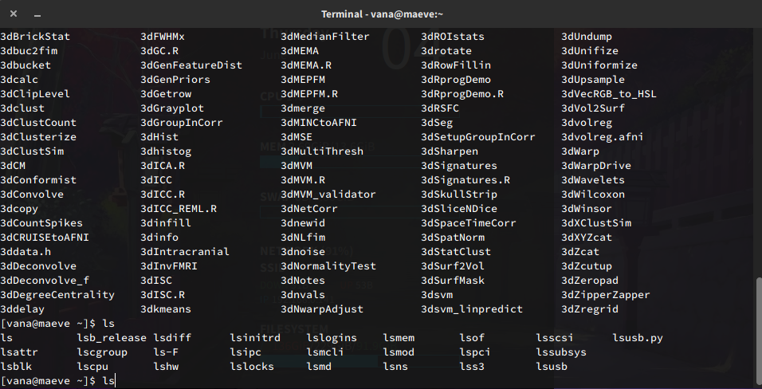
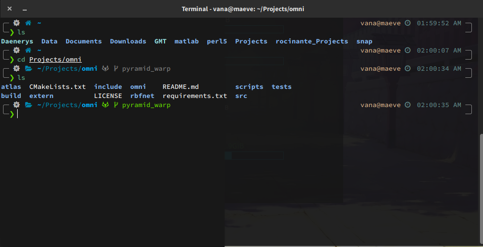
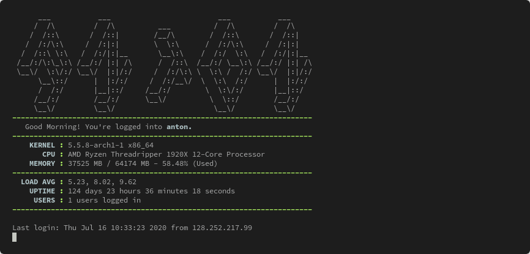

# Andrew's Lab Dotfiles
This repo contains a copy of my own dotfiles with paths and settings that I find to be quite useful. It has been slightly modified for general lab use. In addition to setting up correct paths to versions of software you should be using, it also switches your default shell to `zsh` with a bunch of extra plugins. `zsh` + the plugins allow for several useful shell features that can make you more productive with your terminal!

*Without Andrew's Dotfiles*



*With Andrew's Dotfiles*



*Demo*



These dotfiles are specifically meant for use with our lab systems only (so `maeve` and `rocinante`; `heisenberg` is currently not supported). When logging into other NIL systems, the scripts do not to activate, allowing you to continue to use older lab dotfile configurations without issue.

## Installation

Simply run the line below on either `maeve` or `rocinante`:

```
sh -c "$(curl -fsSL https://gitlab.com/DosenbachGreene/dotfiles/-/raw/master/install.sh)"
```

This will inject the startup script into the appropriate dotfiles based on your current active shell.

Follow and answer any dialog questions that appear.

## Uninstallation

Don't want this anymore? Run this:

```
sh -c "$(curl -fsSL https://gitlab.com/DosenbachGreene/dotfiles/-/raw/master/uninstall.sh)"
```

This will return backed up configs to their original state and remove any installed files.

## Features

- Paths to up-to-date common lab software
    - 4dfp (latest)
    - ANTS (latest)
    - FSL (6.0.3)
    - AFNI (20.0.18)
    - Freesurfer (6.0.0)
    - Connectome Workbench (1.4.2)
- Clear location for user config; Simply use the `~/.paths_user` file and script away!
- Default shell changed to zsh, with the [oh-my-zsh](https://github.com/ohmyzsh/ohmyzsh) plugin manager installed.
- Terminal Theming (Default is set to [powerlevel10k](https://github.com/romkatv/powerlevel10k))
- [zsh-autosuggestions](https://github.com/zsh-users/zsh-autosuggestions) and [zsh-syntax-highlighting](https://github.com/zsh-users/zsh-syntax-highlighting) installed by default.
- Auto-updater for keeping all your paths up-to-date with the rest of the lab.

## FAQ

### What does the install script do to my setup?
The install script identifies your current shell through the `$SHELL` variable to install the appropriate startup file. Currently, the only shells supported are `csh`, `bash` and `zsh`.
A call to the startup file is placed at the very top of your current shell's profile/rc files. This startup file only runs when you are on a supported system (`maeve` and `rocinante` 
at the moment). If you're already on `zsh` all of these steps are skipped.

From there, `zsh` is executed, which calls `~/.zshrc`. Then lab wide software paths are setup (`path_default` file) as well as your own user config file (`~/.paths_user`).

### How do I get the fancy icons like in your screenshot?
You'll need patched fonts, which you can grab from [here](https://www.nerdfonts.com/). If you are using `vnc`, patched fonts should already be installed on our servers (Look for `SauceCodePro Nerd Font`). 

If you are still using the default `powerlevel10k` theme, you'll also need to enable the icons in the configuration (the set of questions asked to you on install, or by typing `p10k configure`)

### I don't see syntax highlighting on my shell!
It is disabled by default for performance reasons (Particularly if you spend most of your time on networked drives).

To enable it, add the `zsh-syntax-highlighting` line to your `plugins` array in
your `~/.zshrc` file.

### What is instant prompt?
It is a feature of the `powerlevel10k` theme. It allows you to start typing commands into your terminal before all the `zsh` plugins finish loading.

If you are using the default configuration, it's recommended that you leave it off. It is only useful if you have a bunch of plugins loaded (see the `plugins` array in `~/.zshrc`)
